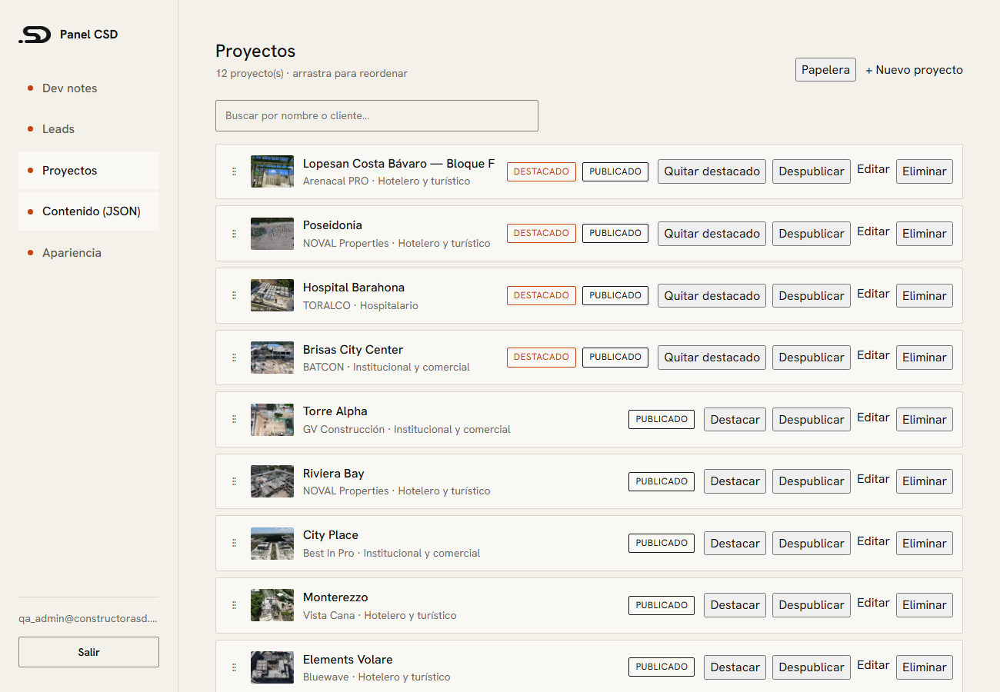
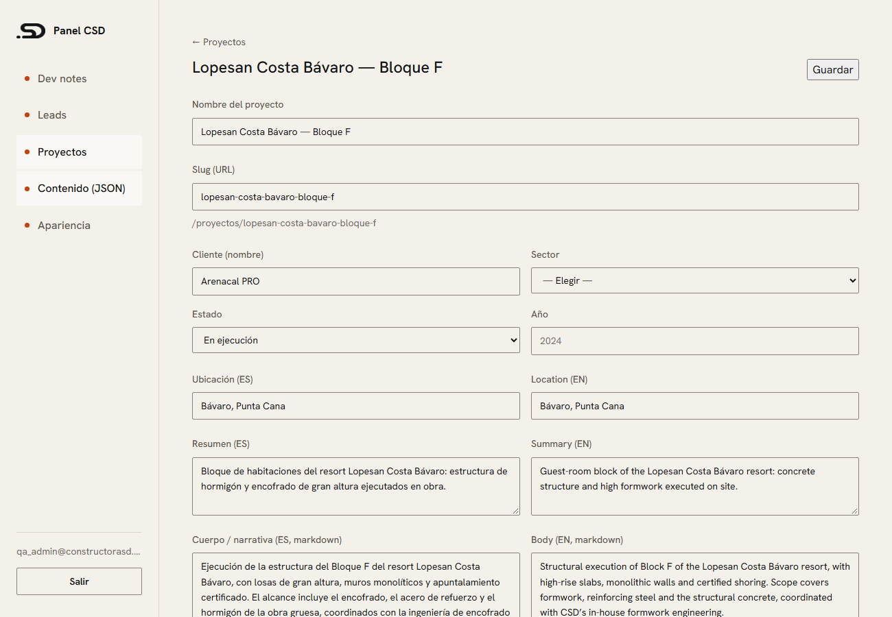
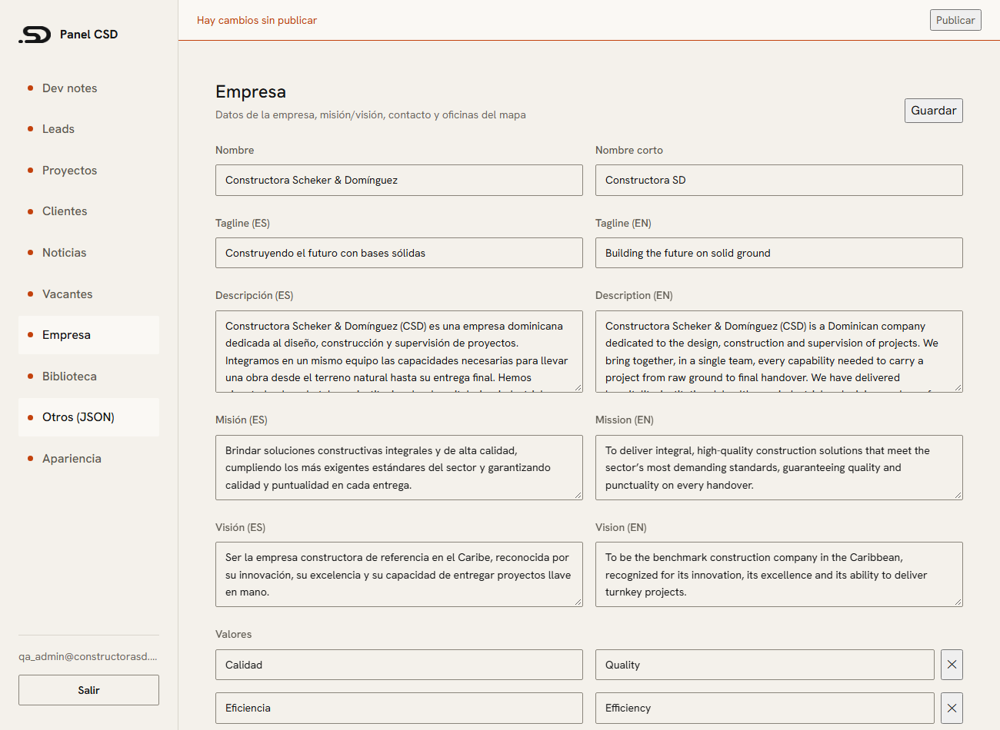

# Guía del panel de administración — constructorasd.com

Para Xaviel. Cómo gestionar **todo el contenido de la web** desde `/admin`, sin tocar JSON ni código.

> **Idea clave:** el sitio es estático (rapidísimo y bueno para Google). Cuando editas algo, **no sale
> en vivo al instante** — queda guardado como borrador y se publica cuando pulsas **Publicar** (la web se
> reconstruye en ~2 minutos). Arriba del panel verás siempre el estado: *"Hay cambios sin publicar"* o
> *"Todo publicado"*.

## 1. Entrar

- Ve a **constructorasd.com/admin** → inicia sesión con tu correo y contraseña.
- Menú lateral: **Dev notes · Leads · Proyectos · Clientes · Noticias · Vacantes · Empresa · Biblioteca ·
  Otros (JSON) · Apariencia**.

## 2. Proyectos



- **Añadir** → botón **“+ Nuevo proyecto”**.
- **Editar** → clic en el nombre o en **Editar**.
- **Reordenar** → arrastra con el agarre **⋮⋮** a la izquierda (el orden se guarda solo).
- **Publicar / Destacar** → botones en cada fila (destacado = aparece en la portada).
- **Eliminar** → va a la **papelera** (botón arriba) y puedes **Restaurar** hasta 30 días.

### Ficha del proyecto



- **Nombre** y **Slug** (la parte de la URL — se genera solo del nombre; si lo cambias en un proyecto ya
  publicado, el enlace viejo redirige al nuevo).
- **Cliente, Sector, Estado, Año, Ubicación** (ES/EN), **Resumen** y **Cuerpo** (ES/EN, admite markdown).
- **Etapas ejecutadas** → marca las que apliquen.
- **Portada** → *Subir portada* (arrastra o elige el archivo). Pide **texto alternativo en ES y EN**
  (obligatorio, es lo que leen Google y los lectores de pantalla).
- **Galería** → sube varias, **arrastra para ordenar**, marca cualquiera como **Portada**, o **Quita**.
- Marca **Publicado** cuando esté listo y pulsa **Guardar**.
- Si falta algo, te avisa con un mensaje claro (ej. *“La portada necesita texto alternativo en inglés”*).

### Cambiar la foto de un proyecto

1. Abre el proyecto → sección **Portada** o **Galería**.
2. **Subir portada** (reemplaza) o **Añadir a la galería**. Pon el alt ES/EN y **Subir**.
3. **Guardar** → **Publicar** cuando quieras que salga en vivo.

> Las imágenes se suben a la nube (Storage). En la publicación, la web las convierte automáticamente a
> formatos optimizados (AVIF/WebP) — no tienes que preparar nada.

## 3. Clientes, Noticias, Vacantes

Igual que Proyectos: lista + ficha.
- **Clientes:** nombre, grupo, logo opcional, orden, publicado.
- **Noticias:** título/extracto/cuerpo (ES/EN, markdown), portada, fecha, publicado.
- **Vacantes:** título/área/ubicación/resumen (ES/EN), **requisitos uno por línea**, tipo, *Abierta*,
  *Publicado*.

## 4. Empresa (textos + mapa)



Un formulario con todo lo de la empresa: nombre, tagline, descripción, misión/visión, **valores**,
**cita**, **estadísticas** (45+, 12, …), **contacto** (teléfonos, email, Instagram, WhatsApp) y
**Oficinas** (los pines del mapa de Contacto).

- **Oficina del mapa:** en **Consulta del mapa** pon unas coordenadas `18.4564,-69.9702` (pin exacto) o un
  lugar `"Punta Cana, República Dominicana"` (centro de ciudad). **URL Cómo llegar** es el enlace del
  botón. Guarda y publica.

## 5. Biblioteca

Todas las imágenes subidas, con **buscador**, **cuántas veces se usa** cada una, y **borrar** (solo si no
se está usando). También puedes subir aquí para usarlas luego.

## 6. Publicar

- Cuando tengas cambios, arriba aparece **“Hay cambios sin publicar — Publicar”**.
- Pulsa **Publicar** → *“Publicando… (~2 min)”* → al terminar, *“Publicado — Ver sitio”*.
- Si tarda, usa **Comprobar**.

## 7. Vista previa (próximamente)

Para revisar un borrador antes de publicar, la vista previa en cliente llega en la siguiente entrega.
Por ahora: publica a un momento de poco tráfico, o revisa primero en el *preview* de dev.

## Consejos

- **Slug:** evita cambiarlo una vez publicado (aunque el redirect lo cubre).
- **Alt ES/EN:** siempre describe la foto (no el nombre del archivo).
- **Fotos:** mínimo 1200 px de ancho (ideal ≥ 1600). Si subes algo menor te avisa.
- **Papelera:** nada se pierde al eliminar; se restaura 30 días.

## 8. Dev notes

Notas de desarrollo con **autoguardado** — no hay botón "Guardar", se guarda solo mientras escribes.
- **Nueva** nota (en blanco) o con plantilla **HANDOFF / Decisión / Bug**. `Ctrl+N` crea una.
- Editor **markdown** con vista dividida (o Editar/Vista en móvil): negritas con `Ctrl+B`, código con
  ``` ```, botón **copiar** en cada bloque de código.
- Estado del guardado arriba: *Guardando… / Guardado · hace Ns / Sin conexión (borrador local)*.
- `Ctrl+S` fuerza un guardado y crea una **versión**. **Versiones** → restaurar una anterior.
- Lista: **buscar**, **fijar** (📌 arriba), **archivar**, tags, exportar `.md`.
- Si editas la misma nota en dos pestañas, te avisa del conflicto (mantener la tuya / usar la del servidor).

## 9. Leads (mensajes y postulaciones)

Bandeja de los contactos que llegan por la web.
- **Badge de no leídos** en el menú y en el título de la pestaña `(3) Admin — CSD`.
- Lista con filtros (estado, tipo, idioma) + **buscar**; **Exportar CSV** del filtro actual (para Excel).
- Clic en un mensaje → **detalle** (todos los campos, teléfono como `tel:`), cambiar **estado**,
  **Responder** (abre el correo), **WhatsApp** si hay número; **notas internas** e **historial de estado**.
  Abrir un mensaje lo marca como leído.
- **Tiempo real:** si llega un mensaje nuevo mientras tienes el panel abierto, aparece un aviso.
- **Postulaciones:** mismo patrón; el CV se previsualiza (PDF) y se descarga con enlace temporal.
