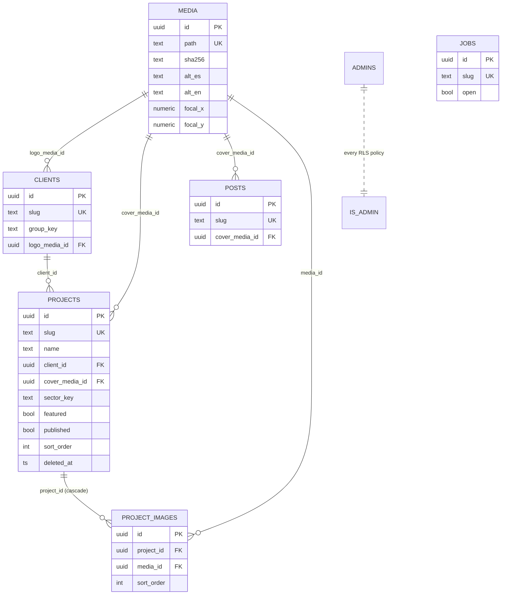

# CMS architecture — constructorasd.com (round 06-oct, WJ1–WJ7)

How Xaviel edits the whole site from `/admin` without touching JSON, files or Claude Code — and how
that content reaches the static, prerendered production site.

## 1. Principle

The public site stays **statically prerendered** (SEO + speed + the round-01 performance budgets). The
CMS edits a database; **publishing is a rebuild** (~2 min). This is the central trade-off: edits are not
live instantly, but every served page is static HTML + optimized AVIF/WebP. The admin makes the rebuild
explicit ("N cambios sin publicar — Publicar", deploy state) and offers a client-side **draft preview**
so Xaviel can review before paying the rebuild.

## 2. Entities & tables (`web` schema)

Collections are normalized tables; singletons stay as form-edited documents in `web.site_content`.

| Entity | Table | Kind | Notes |
|---|---|---|---|
| Uploaded files | `web.media` | rows + Storage `web-media` | sha256, alt ES/EN, focal point |
| Clients | `web.clients` | collection | group, optional logo |
| Projects | `web.projects` | collection | cover + SEO + scope[] + client fk |
| Project gallery | `web.project_images` | child of projects | ordered, caption ES/EN |
| News | `web.posts` | collection | markdown body |
| Jobs | `web.jobs` | collection | requirements[] ES/EN |
| Company / Stages / Sectors / Equipment / Page SEO | `web.site_content` | documents | few fields, form-edited |
| Slug 301s | `web.slug_redirects` | plumbing | written when a published slug changes |
| Publish history | `web.publish_log`, `web.site_state` | plumbing | deploy state, `last_published_at` |
| Admins | `web.admins` + `web.is_admin()` | auth | every policy uses it (WJ7) |

Every collection row carries `published boolean`, `sort_order int`, `updated_at` (touch trigger) and
`deleted_at` (30-day soft-delete trash). Bilingual text is `*_es` / `*_en` columns — never a JSON blob.

### ER diagram



## 3. Security

- **Admin writes:** `web.is_admin()` = the caller's JWT email is in `web.admins`. Seeded with
  `tecnologia@constructorasd.com` (prod) + `qa_admin@constructorasd.com` (**dev only**, Playwright).
  All policies (new tables + the pre-existing `site_content/dev_notes/leads/job_applications/site_settings`)
  now call `is_admin()` instead of a hardcoded email — adding an admin is one INSERT.
- **Public reads:** `anon` may `select` only `published and deleted_at is null` rows; the build consumes
  dedicated `web.v_public_*` views (media joined). The **service role never reaches the browser** — the
  site and admin use the anon key; only edge functions use the service role.
- **Storage:** `web-media` is public-read (optimized copies are what the site serves anyway); insert/
  update/delete require `is_admin()`. 15 MB limit, mime allowlist jpeg/png/webp/svg (svg sanitized in the
  admin before upload).

## 4. Media flow

```
admin uploads original → Storage web-media/<yyyy>/<mm>/<uuid>.<ext> + web.media row (alt, focal)
        │
build (gen-content v2): download each referenced original by sha256 → assets-src/cms/<sha256>.<ext>
        │  (cached in node_modules/.cache/csd-media so repeat builds don't re-download)
optimize-images (+ upscale <1600w) → public/img/cms/<sha256>-{480..2400}.{avif,webp} + LQIP
        │
ImageFigure renders the static AVIF/WebP (focal point → object-position)
```

The admin only ever handles originals; the static pipeline (round 01) is unchanged, so the performance
budgets hold.

## 5. Build flow (publish = rebuild)

```
gen-content v2 (prebuild) ── fetch web.v_public_* (anon) ──► src/content/_cms.json (typed, page shape)
                         └─ download + optimize referenced media ─► public/img/cms/*, manifest
                         └─ web.slug_redirects ─► vercel.generated.json (301s) merged by build-env
pages read _cms.json (same models as today's TS seeds) ; getPrerenderParams reads _cms.json slugs
```

Fallback: a fetch failure in a **dev/preview** build logs loudly and falls back to the TS seeds (never
breaks the preview). In a **prod** build (`ENV_NAME=prod`) a failed fetch **fails the build** — an outage
must not silently publish stale seeds.

## 6. Publish & preview flow

- **Publish:** admin → `web-publish` edge function → Vercel deploy hook. A `web-publish-status` function
  polls the Vercel API (`VERCEL_TOKEN` as an edge secret) for `QUEUED/BUILDING/READY/ERROR`; the admin
  shows live state and links to the site on READY, logging to `web.publish_log` and stamping
  `site_state.last_published_at`. If the token is unavailable (WK2), degrade to a timed message +
  "Comprobar" that fetches `/version.json` (build timestamp + revision).
- **Preview ("Ver borrador"):** the public app, with `?preview=1` **and** an admin Supabase session in the
  browser, fetches draft content client-side (admin RLS) and renders from it with a "Vista previa de
  borrador" banner. Prerendered HTML is untouched → zero SEO impact; preview is client-only and `noindex`.
  Limit: preview images show the Storage original (not yet optimized).

## 7. Admin roles

Single role today (one admin). `web.admins` + `is_admin()` make multi-admin a data change, not a code
change. No per-field permissions — the admin is fully trusted.

## 8. Status (this round)

- **Done:** schema + RLS + views + storage bucket applied to **dev and prod** (`sql/2026-10-06-cms-schema.sql`).
- **Next:** data migration (`scripts/cms/migrate-site-content.mjs`), `gen-content` v2, the admin form-kit
  + CRUD UI, publish/preview, Playwright admin suite, `docs/ADMIN-GUIDE.md`.
